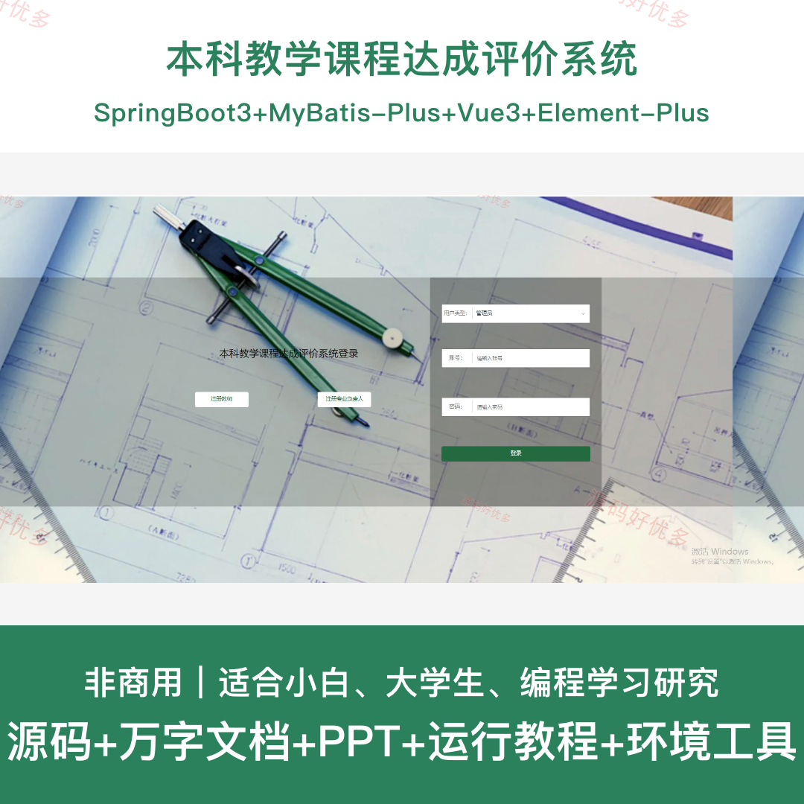
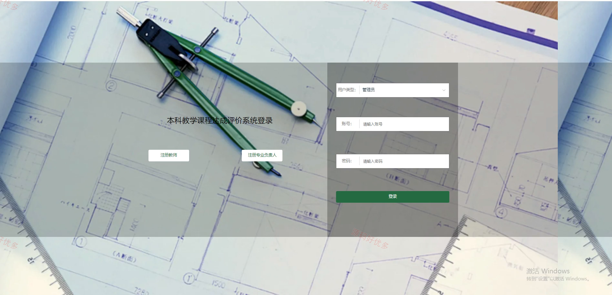
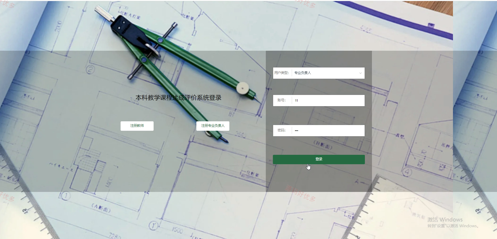
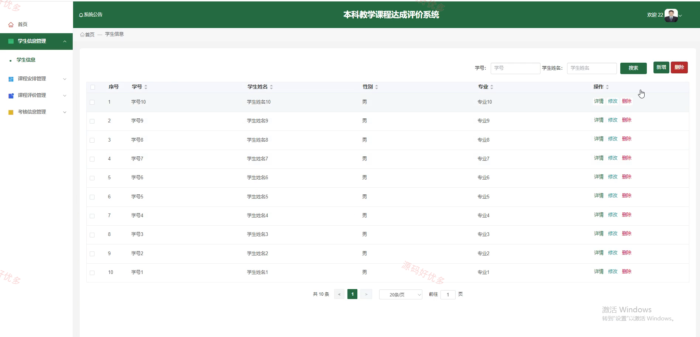
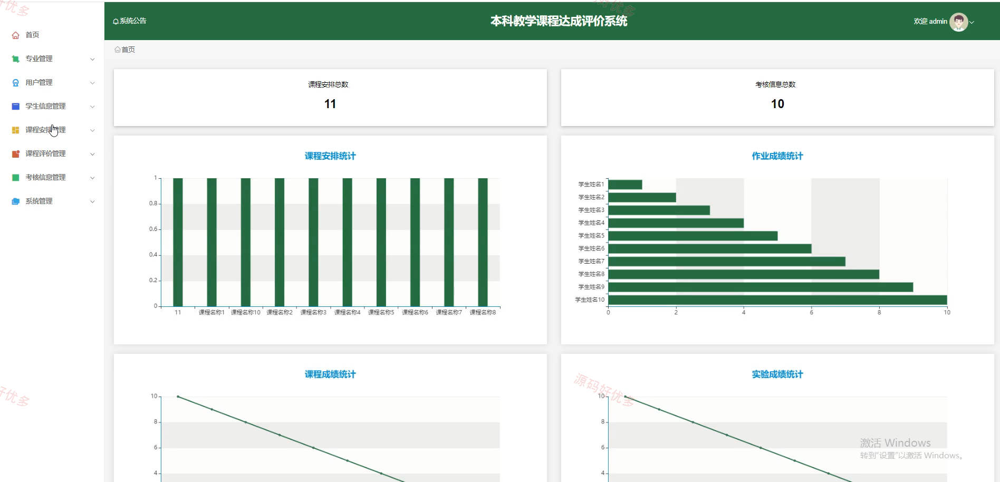
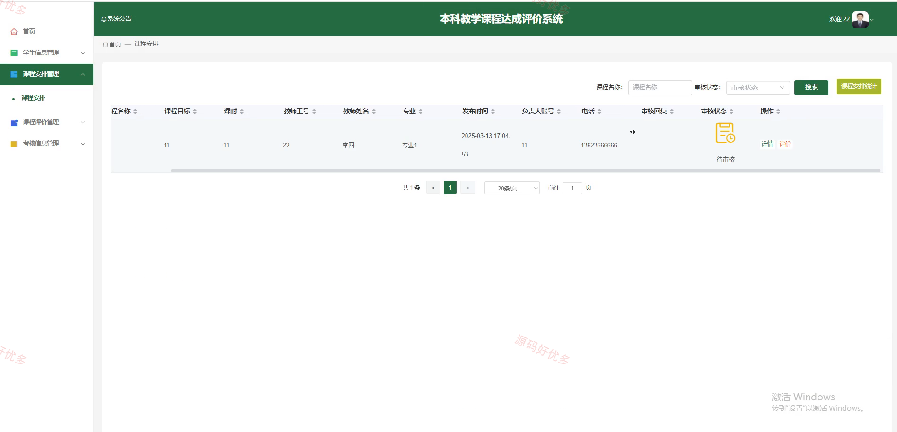
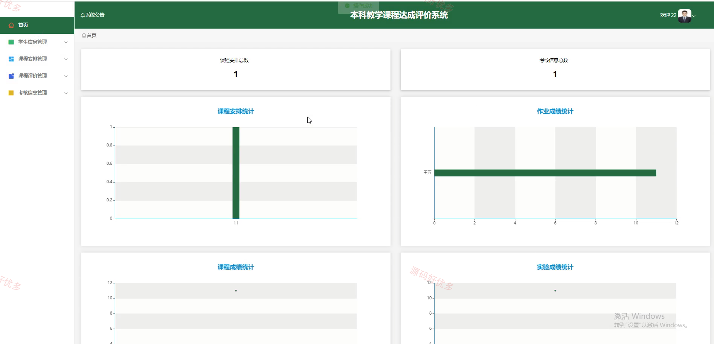
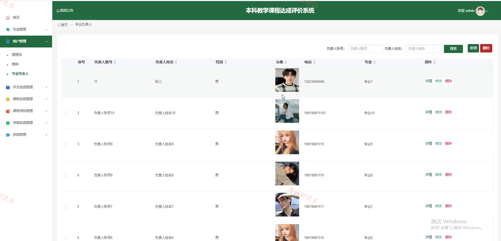
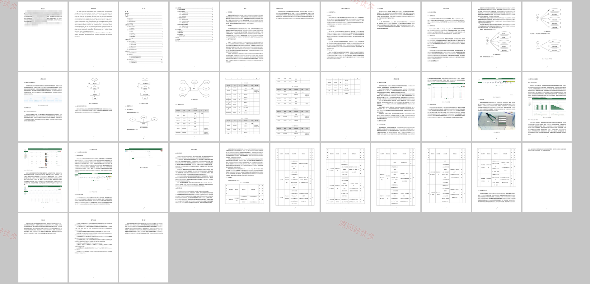

# springbootA570D
springbootA570D本科教学课程达成评价系统
## 源码问题查看主页咨询

### 一、关键词
本科教学课程达成评价系统、课程达成评价、教学考核信息、课程安排管理、专业负责人评价管理

### 二、作品包含
源码+数据库+万字设计文档+PPT+全套环境和工具资源+本地部署教程

### 三、项目技术
前端技术： Html、Css、Js、Vue3.2、Element-Plus
后端技术：Java、SpringBoot3.3.0、MyBatis-Plus

### 四、运行环境（以下版本亲测，其他版本兼容性请自行测试）
开发工具：IDEA/eclipse + VSCODE

数据库：MySQL5.7+（共13张表）

数据库管理工具：Navicat10以上版本

环境配置软件： JDK1.8 + Maven3.6.3

前端Nodejs：16+

浏览器：谷歌浏览器

### 五、项目介绍
项目编号：springbootA570D

本科教学课程达成评价系统面向高校课程达成度评价场景，围绕专业、课程安排、考核信息、课程评价、学生信息和教师信息进行集中管理，支持教师提交课程相关评价数据，专业负责人查看并维护专业建设评价内容，管理员完成基础数据、公告和后台权限维护。

角色：教师、专业负责人、管理员

用户功能：教师登录、课程安排查看、考核信息维护、课程评价提交、个人信息维护；专业负责人登录、专业信息查看、课程达成评价管理、教学质量反馈查看。

管理员功能：教师管理、学生信息管理、专业负责人管理、专业管理、课程安排管理、考核信息管理、课程评价管理、系统公告管理。

### 六、运行截图

